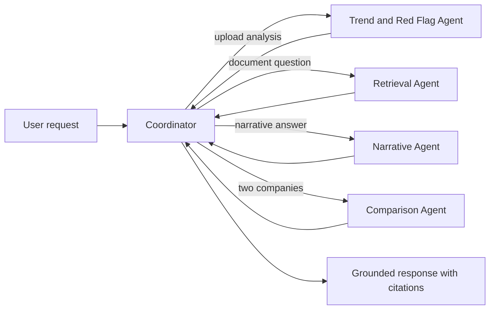

# Conversational Financial Statement Analyzer

## Code-Level Implementation Walkthrough

Owner: **Shubham Shukla**

This document explains the complete implementation flow of the current project: file upload, statement parsing, canonical metric mapping, ratio computation, period-over-period trends, red-flag detection, citations, grounded OpenAI Q&A, reusable embeddings, FastAPI integration, and Streamlit presentation.

The project is intentionally split into deterministic financial analysis and optional language-model behavior. Financial calculations do not depend on an LLM. The LLM is used only when it is configured and only for natural-language answers grounded in the uploaded facts.

---

## 1. High-Level Architecture

The implementation is organized into these layers:

```mermaid
flowchart TD
    U[User uploads CSV Excel or PDF] --> S[Streamlit UI]
    S --> C[core.analyze_upload]
    C --> P[Read table and parse facts]
    P --> N[Normalize metric names]
    N --> R[Compute ratios]
    R --> T[Compute trends and deltas]
    T --> F[Evaluate six red flags]
    F --> A[AnalysisResult]
    A --> S

    Q[User asks a question] --> S
    S --> L[llm.answer_with_openai]
    L --> G[Grounded prompt with uploaded facts]
    G --> O[ChatOpenAI gpt-4o-mini]
    O --> S
    L -. unavailable or failed .-> D[Deterministic answer_question fallback]
    D --> S

    API[FastAPI clients] --> E[/analyze endpoint]
    E --> C
    API --> K[/ask endpoint]
    K --> L
    API --> X[/compare endpoint]

    FA[Future agents] --> EMB[embeddings.py]
    EMB --> OE[OpenAIEmbeddings]
    EMB --> VS[Normalized FAISS vector store]
```

There are four main runtime concerns:

1. **Input handling:** accept an uploaded file and identify its format.
2. **Financial computation:** convert rows into structured facts and calculate ratios and trends.
3. **Reasoning and communication:** identify red flags and answer questions with citations.
4. **Integration:** expose the same functionality through Streamlit and FastAPI, while providing shared embedding utilities for future agents.

---

## 2. Project File Responsibilities

### `financial_analyzer/core.py`

This is the financial-analysis engine. It contains:

- Supported statement metric aliases
- The `Fact` data model
- The `AnalysisResult` data model
- CSV, Excel, and PDF reading
- Metric normalization
- Numeric value cleaning
- Ratio calculations
- Trend and delta calculations
- Six red-flag rules
- Deterministic question answering
- Company comparison

This file should remain the source of truth for financial calculations. Other layers should call it rather than duplicating formulas.

### `financial_analyzer/embeddings.py`

This is the shared embedding and FAISS integration layer. It follows the pattern used in `AgenticAI-Full-main`:

- `OpenAIEmbeddings`
- `text-embedding-3-small`
- LangChain `FAISS`
- Normalized vectors
- `DistanceStrategy.EUCLIDEAN_DISTANCE`
- A cosine-relevance conversion

It is deliberately separate from `core.py`. Future agents can create or load the same vector store without importing Streamlit, FastAPI, or the financial calculation code.

The current Streamlit analysis path does not automatically create embeddings. The module is an integration boundary for the future retrieval and agent workflow.

### `financial_analyzer/llm.py`

This is the shared language-model layer. It:

- Loads `OPENAI_API_KEY` from `.env`
- Creates a grounded prompt
- Sends uploaded facts to `ChatOpenAI`
- Uses `gpt-4o-mini`
- Returns an answer and citations
- Returns `None` when the key is missing or the API call fails

The `None` return value is important because callers can fall back to deterministic local behavior.

### `financial_analyzer/api.py`

This exposes the system as a FastAPI service:

- `POST /analyze` uploads and analyzes a statement
- `POST /ask` asks about a stored analysis session
- `POST /compare` compares two stored analysis sessions
- `GET /health` checks service availability

For local development, sessions are stored in the in-memory `SESSIONS` dictionary.

### `financial_analyzer/streamlit_app.py`

This is the user-facing application. It:

- Provides file upload controls
- Collects the company name
- Calls `analyze_upload`
- Displays the narrative and red flags
- Displays ratio rows
- Provides a chat interface
- Attempts OpenAI Q&A first
- Falls back to deterministic Q&A if needed

### `financial_analyzer/__init__.py`

This exports the main public functions so other project files can import them from the package. It exposes both the financial-analysis API and the shared embeddings/LLM helpers.

### `financial_analyzer/__main__.py`

This exposes the FastAPI app object when the package is used as a module. The normal commands currently use `streamlit` or `uvicorn` directly.

### `tests/test_financial_analyzer.py`

This contains focused tests for:

- Ratio generation
- Red-flag generation
- Citation-backed deterministic Q&A

### `sample_financial_statement.csv`

This is a demonstration input. It contains 2022, 2023, and 2024 values designed to exercise all six red-flag rules.

---

## 3. Input Contract

The analyzer expects a table with:

- The first column containing metric labels
- Every remaining column containing a reporting period
- Numeric values in the body

Example:

```csv
Metric,2022,2023,2024
Revenue,1000,1100,1200
Gross Profit,420,440,450
Operating Income,160,150,132
Net Income,110,105,95
Cash From Operations,105,85,60
Accounts Receivable,100,130,180
Inventory,120,150,210
Current Assets,600,560,500
Current Liabilities,500,540,600
Total Assets,1800,1900,2100
Total Debt,600,760,1300
Total Equity,1000,950,900
Interest Expense,30,38,60
```

The parser does not require one file per statement. It can process a combined table containing income-statement, balance-sheet, and cash-flow metrics.

The first row becomes the DataFrame header. In the example:

- `Metric` is the metric column.
- `2022`, `2023`, and `2024` are the period columns.

---

## 4. Core Data Models

## 4.1 `Fact`

Defined in `core.py`:

```python
@dataclass
class Fact:
    company: str
    metric: str
    period: str
    value: float
    statement: str
    source: str
```

A `Fact` is the normalized representation of one financial value.

For example, this input cell:

```text
Revenue | 2024 | 1200
```

becomes conceptually:

```python
Fact(
    company="Sample Company",
    metric="revenue",
    period="2024",
    value=1200.0,
    statement="Financial statements",
    source="sample_financial_statement.csv",
)
```

The fields have these meanings:

- `company`: user-provided company name.
- `metric`: canonical internal name such as `revenue` or `total_debt`.
- `period`: string representation of the source column, such as `2024` or `FY2024`.
- `value`: parsed numeric value.
- `statement`: inferred statement category.
- `source`: uploaded filename.

### `Fact.citation()`

```python
def citation(self) -> str:
    return f"[{self.company} | {self.statement} | {self.metric} | {self.period} | {self.source}]"
```

This creates a compact source label, for example:

```text
[Sample Company | Financial statements | revenue | 2024 | sample_financial_statement.csv]
```

The citation is attached to ratio inputs, red-flag evidence, deterministic answers, and LLM context.

---

## 4.2 `AnalysisResult`

```python
@dataclass
class AnalysisResult:
    company: str
    periods: list[str]
    facts: list[Fact]
    ratios: dict[str, list[dict[str, Any]]]
    trends: list[dict[str, Any]]
    red_flags: list[dict[str, Any]]
    narrative: str
```

This is the complete result of processing one upload.

### `company`

The company name typed by the user.

### `periods`

The unique period values discovered in fact order. For a three-year input this is usually:

```python
["2022", "2023", "2024"]
```

### `facts`

All normalized source values extracted from the uploaded document.

### `ratios`

A dictionary where each key is a ratio name and each value is a list of period/value/citation records.

Example:

```python
{
    "current_ratio": [
        {
            "period": "2024",
            "value": 0.8333,
            "citations": [
                "[Sample Company | ... | current_assets | 2024 | ...]",
                "[Sample Company | ... | current_liabilities | 2024 | ...]",
            ],
        }
    ]
}
```

### `trends`

One record is created for every ratio that has at least two comparable points. Each record contains:

- The ratio name
- The first available point
- The latest available point
- Direction
- Absolute delta
- Percentage change

### `red_flags`

A list of rule results. Every triggered flag contains:

- `name`
- `severity`
- `message`
- `evidence`
- `citations`

### `narrative`

A short deterministic summary containing the company, periods, watch areas, and notable movements.

### `AnalysisResult.to_dict()`

This method converts the dataclass into JSON-compatible dictionaries for FastAPI responses. `Fact` objects are converted with `asdict`, and each fact receives an additional citation field.

---

## 5. Upload and Parsing Flow

The main entry point is:

```python
def analyze_upload(data: bytes, filename: str, company: str) -> AnalysisResult:
    return compute_analysis(parse_facts(data, filename, company), company)
```

The flow is:

1. Receive raw uploaded bytes.
2. Read those bytes into a table.
3. Normalize supported row labels.
4. Create `Fact` objects.
5. Compute ratios and rules.
6. Return one `AnalysisResult`.

### `_read_table`

```python
def _read_table(data: bytes, filename: str) -> pd.DataFrame:
```

This function selects the reader based on the filename suffix.

#### Excel

For `.xlsx` and `.xls`:

```python
pd.read_excel(io.BytesIO(data))
```

`io.BytesIO` lets pandas read the uploaded bytes without writing a temporary file.

#### PDF

For `.pdf`:

1. Import `pdfplumber` lazily.
2. Open the byte stream.
3. Extract tables page by page.
4. Combine table rows.
5. Treat the first extracted row as headers.
6. Build a DataFrame from the remaining rows.

PDF support is table-oriented. A PDF with only images, scanned pages, or complex non-tabular layout may require OCR or a specialized extraction step.

#### CSV and other suffixes

All other suffixes go through:

```python
pd.read_csv(io.BytesIO(data))
```

This means a normal CSV upload is the simplest supported path.

### `parse_facts`

```python
def parse_facts(data: bytes, filename: str, company: str) -> list[Fact]:
```

This function performs validation and normalization:

1. Calls `_read_table`.
2. Removes completely empty rows with `dropna(how="all")`.
3. Requires at least two columns.
4. Treats the first column as the metric-label column.
5. Treats every other column as a period.
6. Infers a broad statement label from the filename.
7. Iterates through every row.
8. Converts the row label using `_canonical_metric`.
9. Converts each value using `_number`.
10. Creates one `Fact` for each valid metric-period cell.
11. Raises an error if no supported facts are found.

A row that does not match a supported alias is ignored. This allows extra rows to exist in a source file without breaking analysis.

### Statement inference

The filename is used only for a broad citation label:

- Filename contains `balance`: `Balance Sheet`
- Filename contains `cash`: `Cash Flow Statement`
- Filename contains `income` or `profit`: `Income Statement`
- Otherwise: `Financial statements`

This is not a full accounting-statement classifier. It is a lightweight source label for citations.

---

## 6. Metric Normalization

### `STATEMENT_ALIASES`

The alias dictionary maps multiple input labels to one canonical metric.

Examples:

```python
"revenue": {"revenue", "sales", "net sales", "total revenue"}
"net_income": {"net income", "net profit", "profit after tax", "pat"}
"total_debt": {"total debt", "debt", "borrowings", "total borrowings"}
```

This is important because financial statements use different labels for similar concepts.

### `_clean_label`

```python
def _clean_label(value: Any) -> str:
    return re.sub(r"[^a-z0-9 ]", "", str(value).lower()).strip()
```

The function:

1. Converts the input to a string.
2. Converts it to lowercase.
3. Removes characters outside lowercase letters, digits, and spaces.
4. Trims leading and trailing whitespace.

For example:

```text
" Net Income ($) " -> "net income"
```

### `_canonical_metric`

```python
def _canonical_metric(label: str) -> str | None:
```

This function cleans the label, checks each alias set, and returns the canonical internal metric name.

It first accepts an exact alias match. It also accepts a containment match, which allows labels with extra descriptive text.

If no alias matches, it returns `None`, and the row is skipped.

### `_number`

```python
def _number(value: Any) -> float | None:
```

This function converts common financial formats into floats.

It handles:

- Missing values
- Commas: `1,200` becomes `1200`
- Dollar signs
- Euro signs
- Pound signs
- Parentheses for negatives: `(100)` becomes `-100`
- Percent symbols
- Whitespace

Invalid values return `None` instead of stopping the entire upload.

---

## 7. Ratio Calculation Engine

### `_fact_map`

```python
def _fact_map(facts: list[Fact]) -> dict[tuple[str, str], Fact]:
    return {(fact.metric, fact.period): fact for fact in facts}
```

This creates O(1)-style dictionary lookup by:

```text
(metric, period)
```

For example:

```python
("revenue", "2024") -> Fact(...)
```

This avoids repeatedly scanning the full fact list for every ratio.

### `_ratio`

```python
def _ratio(
    name: str,
    numerator: str,
    denominator: str,
    facts: list[Fact],
    periods: list[str],
    scale: float = 1.0,
) -> list[dict[str, Any]]:
```

The `name` argument is currently descriptive and is not stored inside the returned point. The calculation uses:

```text
ratio = numerator / denominator * scale
```

For each period:

1. Find the numerator fact.
2. Find the denominator fact.
3. Skip the period if either is missing.
4. Skip the period if the denominator is zero.
5. Calculate and round to four decimal places.
6. Attach both input citations.

The scale is used to convert ratios to human-readable units:

- `1.0` for ordinary ratios
- `100` for percentage ratios
- `365` for DSO days

### Ratios currently computed

| Ratio key | Formula | Scale | Meaning |
|---|---|---:|---|
| `current_ratio` | Current Assets / Current Liabilities | 1 | Short-term coverage |
| `debt_to_equity` | Total Debt / Total Equity | 1 | Financial leverage |
| `debt_ratio` | Total Debt / Total Assets | 1 | Asset financing by debt |
| `gross_margin_percent` | Gross Profit / Revenue | 100 | Gross profitability |
| `operating_margin_percent` | Operating Income / Revenue | 100 | Operating profitability |
| `net_margin_percent` | Net Income / Revenue | 100 | Net profitability |
| `dso_days` | Accounts Receivable / Revenue | 365 | Approximate collection days |
| `inventory_to_revenue` | Inventory / Revenue | 1 | Inventory relative to sales |
| `cfo_to_net_income` | Cash From Operations / Net Income | 1 | Earnings cash conversion |
| `return_on_assets_percent` | Net Income / Total Assets | 100 | Return generated by assets |
| `return_on_equity_percent` | Net Income / Total Equity | 100 | Return generated by equity |

Important limitation: DSO is implemented as `Accounts Receivable / Revenue * 365`. It is an approximation because a production financial model may use average receivables, credit sales, and exact day counts.

---

## 8. Trend and Period-over-Period Analysis

After all ratios are computed, `compute_analysis` loops through every ratio:

```python
for name, points in result.ratios.items():
    if len(points) >= 2:
        ...
```

A ratio needs at least two valid period points before a trend can be produced.

The current implementation compares the first available ratio point with the latest available ratio point.

### Direction

```python
direction = (
    "increased" if last["value"] > first["value"]
    else "decreased" if last["value"] < first["value"]
    else "was flat"
)
```

### Absolute delta

```python
delta = round(last["value"] - first["value"], 4)
```

For example:

```text
2022 current ratio: 1.20
2024 current ratio: 0.83
Delta: -0.37
```

### Percentage change

```python
percent_change = round(delta / first["value"] * 100, 4) if first["value"] else None
```

If the first value is zero, percentage change is set to `None` to avoid division by zero.

Each trend record has this shape:

```python
{
    "metric": "current_ratio",
    "from": {...},
    "to": {...},
    "direction": "decreased",
    "delta": -0.3667,
    "percent_change": -30.5583,
}
```

The `from` and `to` objects retain their original period values and citations, so the trend remains auditable.

### Important implementation detail

The current output compares the first and last available points. It does not currently emit a separate delta record for every adjacent pair such as:

```text
2022 -> 2023
2023 -> 2024
```

If the final assignment requires strictly adjacent period deltas, the trend loop can be extended to iterate over `zip(points, points[1:])`. The current implementation still provides a period-over-period summary across the available range.

---

## 9. Six Red-Flag Rules

The red flags are implemented inside `compute_analysis` after ratio generation.

### Internal `flag` helper

```python
def flag(name, severity, message, ratio_name):
```

This helper:

1. Retrieves the ratio series.
2. Requires at least two points.
3. Uses the last two points as evidence.
4. Stores the evidence points.
5. Flattens their citations into a citation list.
6. Appends a red-flag record.

The use of the last two points means red flags focus on the latest change, while trend records summarize the first-to-last movement.

### 9.1 Accrual-quality gap

Condition:

```python
cfo and cfo[-1]["value"] < 0.8
```

Ratio:

```text
Cash From Operations / Net Income
```

Interpretation: operating cash flow is less than 80% of reported net income. This can indicate that accounting earnings are not converting into cash effectively.

Severity: `high`

### 9.2 DSO climbing

Condition:

```python
dso[-1]["value"] > dso[-2]["value"]
```

Ratio:

```text
Accounts Receivable / Revenue * 365
```

Interpretation: customers are taking longer to pay, increasing working-capital pressure.

Severity: `medium`

### 9.3 Margin compression

Condition:

```python
margins[-1]["value"] < margins[-2]["value"]
```

Ratio:

```text
Operating Income / Revenue * 100
```

Interpretation: the company is retaining less operating profit per unit of revenue.

Severity: `medium`

### 9.4 Leverage stress

Condition:

```python
leverage and leverage[-1]["value"] > 1
```

Ratio:

```text
Total Debt / Total Equity
```

Interpretation: debt exceeds equity in the latest period.

Severity: `high`

### 9.5 Inventory build-up

Condition:

```python
inventory[-1]["value"] > inventory[-2]["value"]
```

Ratio:

```text
Inventory / Revenue
```

Interpretation: inventory is becoming larger relative to sales, which may indicate slower movement or overstocking.

Severity: `medium`

### 9.6 Liquidity deterioration

Condition:

```python
liquidity and liquidity[-1]["value"] < 1
```

Ratio:

```text
Current Assets / Current Liabilities
```

Interpretation: current assets are insufficient to cover current liabilities in the latest period.

Severity: `high`

---

## 10. Narrative Generation

### `build_narrative`

This function creates a short deterministic summary.

If there are no trends or red flags, it reports that the data is limited.

Otherwise it adds:

1. Company and period coverage.
2. Names of triggered watch areas.
3. Direction of selected notable ratios.

The selected notable ratios are:

- Current ratio
- Debt-to-equity
- Operating margin
- DSO

The narrative is intentionally concise. Detailed evidence remains available in `ratios`, `trends`, and `red_flags`.

---

## 11. Grounded Question Answering

There are two Q&A paths.

## 11.1 OpenAI path: `answer_with_openai`

Defined in `llm.py`:

```python
def answer_with_openai(result: AnalysisResult, question: str) -> dict[str, object] | None:
```

### Configuration check

`openai_is_configured()` calls `load_dotenv()` and checks whether `OPENAI_API_KEY` exists.

The key is not hardcoded in source code. It should be stored locally in `.env`, which is ignored by Git.

### Context construction

Every fact becomes a line:

```text
- revenue | 2024 | 1200 | [Company | Statement | revenue | 2024 | source.csv]
```

The complete fact list is passed into the grounded prompt.

### Prompt rules

The prompt tells the model:

- Use only the supplied facts.
- Refuse when the facts do not contain the answer.
- Do not invent or calculate unsupported facts.
- Keep the answer concise.
- End with a `Sources:` line.

### Model invocation

```python
llm = ChatOpenAI(model="gpt-4o-mini", temperature=0)
response = (GROUNDED_PROMPT | llm).invoke(...)
```

This follows the LangChain composition style used in `AgenticAI-Full-main`:

```text
Prompt | Model
```

Temperature `0` is used for predictable, factual responses.

### Error handling

Any API, authentication, quota, network, or response error returns `None`.

Returning `None` is intentional. It allows the caller to use the deterministic fallback instead of failing the entire application.

## 11.2 Deterministic fallback: `answer_question`

Defined in `core.py`:

```python
def answer_question(
    result,
    question,
    answerer=None,
):
```

The function first tokenizes the question and ranks facts based on word overlap with the canonical metric name.

For example, a question containing `revenue` ranks revenue facts highly.

If an `answerer` callable is supplied, it is attempted first. The OpenAI helper is passed as this injected provider by FastAPI.

If the provider returns `None` or raises an exception, deterministic matching continues.

If no matching fact exists, the answer is:

```text
I don't have that information in the uploaded statements.
```

Otherwise it returns up to three matching fact statements and their citations.

This provider-injection design lets future agents replace or extend the answerer without rewriting the core parser and ratio code.

---

## 12. Shared Embeddings and FAISS

### Why embeddings are separate

Embeddings are an infrastructure concern, not a financial formula concern. Separating them means:

- The Trend and Red Flag Agent does not own the embedding client.
- Future retrieval agents can reuse the same model and index settings.
- Streamlit and FastAPI do not need to know how vectors are created.
- Different team members can prepare agents independently against a shared contract.

### `create_embeddings`

```python
def create_embeddings(model: str = EMBEDDING_MODEL) -> OpenAIEmbeddings:
```

This function:

1. Loads `.env`.
2. Requires `OPENAI_API_KEY`.
3. Creates `OpenAIEmbeddings(model="text-embedding-3-small")`.

The model choice matches the repository examples.

### `cosine_relevance`

```python
def cosine_relevance(distance: float) -> float:
    return 1.0 - distance / 2.0
```

The FAISS store is configured with normalized vectors and squared Euclidean distance. For normalized vectors:

```text
squared L2 distance = 2 - 2 * cosine similarity
```

Rearranging gives:

```text
cosine similarity = 1 - distance / 2
```

This function converts FAISS distance into the relevance scale expected by the RAG examples.

### `build_vector_store`

```python
def build_vector_store(documents, embeddings, ids=None) -> FAISS:
```

This calls `FAISS.from_documents` with:

- The supplied LangChain documents
- The shared embedding client
- Optional stable document IDs
- The shared relevance function
- Shared normalized-distance settings

### `save_vector_store`

This creates the index directory if necessary and calls LangChain’s `save_local`.

Default values:

```python
DEFAULT_INDEX_DIR = Path("financial_analyzer_indexes")
DEFAULT_INDEX_NAME = "financial_statements"
```

FAISS normally creates index files using the index name, such as:

```text
financial_analyzer_indexes/financial_statements.faiss
financial_analyzer_indexes/financial_statements.pkl
```

### `load_vector_store`

Before loading, it checks for the `.faiss` file. If it is absent, it raises a clear error telling the caller to build and save the store first.

It uses `allow_dangerous_deserialization=True`, matching the repository examples. This should only be used with index files generated and trusted by the application.

### Future-agent usage

```python
from financial_analyzer.embeddings import (
    build_vector_store,
    create_embeddings,
    load_vector_store,
    save_vector_store,
)

embeddings = create_embeddings()
store = build_vector_store(documents, embeddings, ids=document_ids)
save_vector_store(store)
```

Another agent can later load the same index:

```python
embeddings = create_embeddings()
store = load_vector_store(embeddings)
results = store.similarity_search_with_relevance_scores(question, k=4)
```

The index contract should stay stable across all agents.

---

## 13. Streamlit Flow

The application starts with:

```powershell
streamlit run financial_analyzer/streamlit_app.py
```

### Import-path setup

Because Streamlit launches a file inside the package, the script explicitly adds the project root to `sys.path`:

```python
PROJECT_ROOT = Path(__file__).resolve().parent.parent
sys.path.insert(0, str(PROJECT_ROOT))
```

This prevents:

```text
ModuleNotFoundError: No module named 'financial_analyzer'
```

### Session state

The app stores the current result in:

```python
st.session_state.result
```

It stores chat messages in:

```python
st.session_state.messages
```

Streamlit reruns the script after interaction, so session state is necessary to preserve the analysis and conversation.

### Sidebar upload

The sidebar collects:

- Company name
- CSV, Excel, or PDF file

When the Analyze button is clicked:

```python
st.session_state.result = analyze_upload(
    uploaded.getvalue(),
    uploaded.name,
    company,
)
```

Errors from parsing are shown with `st.error`.

### Overview tab

The Overview tab displays:

- Company name
- Generated narrative
- Warning boxes for red flags
- Citations attached to red flags

### Ratios tab

The ratios dictionary is flattened into rows with:

- Ratio name
- Period
- Value

Those rows are shown through `st.dataframe`.

### Grounded Q&A tab

For each question:

1. Try `answer_with_openai`.
2. If it returns `None`, call deterministic `answer_question`.
3. Append user and assistant messages to session state.
4. Display citations.
5. Call `st.rerun()` to refresh the chat display.

---

## 14. FastAPI Flow

Start the API with:

```powershell
uvicorn financial_analyzer.api:app --reload
```

### `/analyze`

Request type:

- Multipart uploaded file
- `company` form field
- `session_id` form field

Flow:

1. Read uploaded bytes.
2. Call `analyze_upload`.
3. Store the result in `SESSIONS[session_id]`.
4. Return `result.to_dict()`.

### `/ask`

Request body:

```json
{
  "session_id": "session-123",
  "question": "What happened to revenue?"
}
```

Flow:

1. Find the analysis result in `SESSIONS`.
2. Return 404 if it does not exist.
3. Call `answer_question` with `answer_with_openai` injected.
4. OpenAI is attempted first.
5. Deterministic fallback runs if necessary.

### `/compare`

Request body:

```json
{
  "left_session_id": "company-a",
  "right_session_id": "company-b"
}
```

The endpoint loads both results and calls `compare_results`.

### `/health`

Returns:

```json
{"status": "ok"}
```

### In-memory session limitation

`SESSIONS` is a Python dictionary. It is suitable for local development but not durable production storage. Restarting the API loses sessions. A later production version should use a database, cache, or object store.

---

## 15. Company Comparison

### `compare_results`

This function compares the intersection of ratio names from two analyses.

For each shared ratio, it selects the latest available point from each company and returns a row containing:

- Ratio name
- Left company value and evidence
- Right company value and evidence

If period lists differ, it adds this warning:

```text
Fiscal periods differ; compare directionally rather than as a like-for-like year pair.
```

This is a conservative behavior. It prevents users from assuming two latest values represent the same fiscal period when they do not.

---

## 16. End-to-End Example

Suppose the user uploads `sample_financial_statement.csv` and enters `Sample Company`.

### Step 1: Streamlit receives the file

```python
uploaded.getvalue()
```

returns raw bytes.

### Step 2: Parsing creates facts

Rows such as:

```text
Operating Income,160,150,132
```

become three facts:

```text
operating_income | 2022 | 160
operating_income | 2023 | 150
operating_income | 2024 | 132
```

### Step 3: Ratios are computed

For 2024:

```text
Operating margin = 132 / 1200 * 100 = 11.0%
```

### Step 4: Trend is generated

If 2022 operating margin was 16.0%:

```text
Delta = 11.0 - 16.0 = -5.0 percentage points
Percent change = -5.0 / 16.0 * 100 = -31.25%
```

### Step 5: Margin compression rule runs

The latest operating margin is lower than the previous period, so the rule emits:

```text
Margin compression
```

### Step 6: Overview displays evidence

The UI shows the warning and citations for the last two ratio points.

### Step 7: User asks a question

Question:

```text
What was revenue in 2024?
```

The OpenAI path receives the uploaded facts and citation labels. If it returns successfully, the response is shown. If the call fails, the deterministic answerer finds the revenue facts by token overlap and returns the matching value with a citation.

---

## 17. Future Multi-Agent Integration

The project is ready for the other three agents to be merged through stable data contracts.

### Recommended agent boundaries

#### Trend and Red Flag Agent

Current implementation in `core.py`:

- Reads normalized facts
- Computes ratios
- Computes trend records
- Evaluates red flags
- Returns evidence-backed results

#### Retrieval or Document Agent

Should use:

```python
from financial_analyzer.embeddings import create_embeddings, build_vector_store, load_vector_store
```

It should return retrieved `Document` objects with metadata and source labels.

#### Narrative or Q&A Agent

Should accept:

- `AnalysisResult`
- Retrieved documents or facts
- User question

It should return a stable shape such as:

```python
{
    "answer": "...",
    "citations": ["..."],
}
```

#### Comparison Agent

Should accept two `AnalysisResult` objects and return comparable ratio rows plus warnings about period mismatch.

### Recommended orchestrator shape

A future coordinator can route requests like this:



The coordinator should not reimplement financial formulas. It should call the existing analysis service and pass structured results between agents.

### Shared contract recommendations

Keep these fields stable:

```python
Fact:
    company
    metric
    period
    value
    statement
    source

AnalysisResult:
    company
    periods
    facts
    ratios
    trends
    red_flags
    narrative

Answer:
    answer
    citations
```

Stable schemas will let team members merge their agents without coupling everything to one implementation file.

---

## 18. Error Handling and Known Limitations

### Missing data

A ratio is omitted for a period when its numerator or denominator is unavailable. This is preferable to inventing or imputing a value.

### Zero denominator

A ratio is omitted when its denominator is zero.

### Unsupported labels

Rows that do not match `STATEMENT_ALIASES` are skipped.

### PDF extraction

PDF support depends on tables being extractable by `pdfplumber`. Scanned image PDFs are not automatically OCR'd.

### LLM availability

OpenAI failure does not stop deterministic analysis. The Q&A path falls back locally.

### API key security

Never commit `.env` or print `OPENAI_API_KEY`. If a key is exposed, revoke it and create a replacement.

### In-memory API sessions

FastAPI sessions disappear when the process restarts and are not shared across multiple workers.

### Financial interpretation

The rules are screening heuristics, not investment advice or a complete audit. A red flag indicates an area for review, not proof of fraud, distress, or misstatement.

---

## 19. Running the Project

From the project root:

```powershell
.venv\Scripts\activate
streamlit run financial_analyzer\streamlit_app.py
```

Then upload:

```text
sample_financial_statement.csv
```

For the API:

```powershell
.venv\Scripts\activate
uvicorn financial_analyzer.api:app --reload
```

The default Streamlit port is `8501`. If that port is occupied, use:

```powershell
streamlit run financial_analyzer\streamlit_app.py --server.port 8502
```

---

## 20. Summary of Responsibilities

| Component | Responsibility | Uses OpenAI? |
|---|---|---:|
| `core.py` | Parse facts, calculate ratios, trends, red flags, fallback Q&A | No |
| `embeddings.py` | Create and persist shared vector stores | Yes, when called |
| `llm.py` | Grounded natural-language Q&A | Yes, when configured |
| `streamlit_app.py` | Interactive UI | Indirectly through `llm.py` |
| `api.py` | HTTP integration and session routing | Indirectly through `llm.py` |
| `__init__.py` | Public package exports | No |
| Tests | Verify core behavior | No |

The central design principle is separation of concerns: financial facts and calculations are deterministic and auditable, language-model behavior is grounded and replaceable, and embeddings are isolated so future agents can share one retrieval infrastructure.
